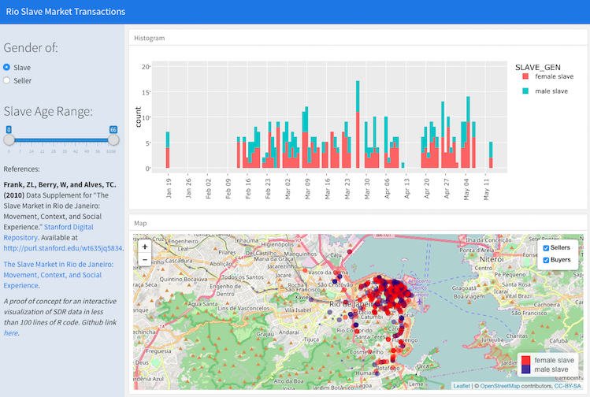

```{r global_options, echo=FALSE, include=FALSE}
knitr::opts_chunk$set(echo=TRUE,
               message=FALSE,
               warning=FALSE)
```

## plot

```{r fig.height=4}
plot(cars)
```

## ggplot2 {.smaller}
```{r}
library(ggplot2)
ggplot(cars, aes(speed, dist)) + geom_point()
```

The second (2016) edition of the book is [here](http://link.springer.com/book/10.1007/978-3-319-24277-4)!


## ggthemes {.smaller}
```{r}
library(ggthemes)
ggplot(cars, aes(speed, dist)) + geom_point() + geom_rangeframe() + theme_tufte()
```

## ggiraph {.smaller}
```{r}
library(ggiraph)
p <- ggplot(cars, aes(speed, dist, tooltip = speed/dist)) + geom_point_interactive()
ggiraph(code = {print(p)}, height_svg = 4)
```

## ggvis {.smaller}
```{r}
library(ggvis)
cars %>% ggvis(~speed, ~dist) %>% layer_points()
```

more on [ggvis vs. ggplot](http://ggvis.rstudio.com/ggplot2.html)


## plotly, using plot_ly function {.smaller}

```{r }
library(plotly)
plot_ly(cars, x = speed, y = dist, mode = "markers")
```

## plotly, using ggplotly function  {.smaller}

```{r}
p <- ggplot(cars, aes(speed, dist)) + geom_point()
ggplotly(p)
```

## shiny


## shiny
```{r, eval=FALSE}
inputPanel(
 sliderInput("speed_range", label = "Range of Speed:",
          min = min(cars$speed), max = max(cars$speed), 
          value = range(cars$speed))
)

renderPlot({
  cars_subs <- subset(cars, speed >= input$speed_range[1] & 
                        speed < input$speed_range[2])
  
  ggplot(cars_subs, aes(speed, dist)) + geom_point()
})
```

http://www.showmeshiny.com

## flexdashboard {.flexbox .vcenter}



https://cengel.shinyapps.io/RioSlaveMarket/

## Access to SUL Social Science Data {.flexbox .vcenter}
> - API (R package)
> - direct link to _CSV_
> - download via GUI
> - no direct access
> - [more..](SULdataAccess.html)

## 


## World Bank Data


[worked example](worldbank.html)

## r-esources @ stanford  {.flexbox .vcenter}

> - [r.stanford.edu](http://r.stanford.edu)
> - [r-stanford mailing list](https://mailman.stanford.edu/mailman/listinfo/r-stanford) 
> - R Open Lab Wedsdays 3-5pm **-- HERE!**